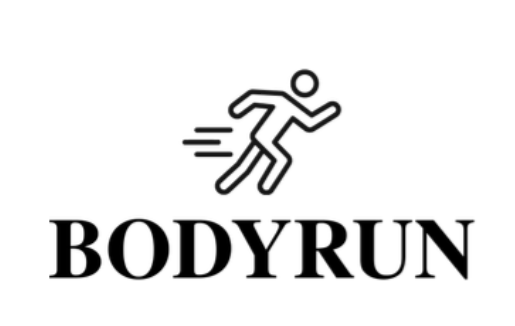

# 🏃‍♂️ BodyRun - Tu meta en segundos

[](https://developer.mozilla.org/es/docs/Web/HTML)
[](https://developer.mozilla.org/es/docs/Web/CSS)
[](https://developer.mozilla.org/es/docs/Web/JavaScript)
[](https://getbootstrap.com/)
[](https://jquery.com/)

<p align="center">
  
</p>

## 📋 Descripción del Proyecto

BodyRun es una aplicación web dedicada al bienestar y la nutrición, ofreciendo herramientas para el cálculo de IMC, planes de déficit calórico, superávit calórico y mantenimiento de peso. La aplicación está diseñada para ayudar a los usuarios a alcanzar sus metas de salud de manera informada y efectiva.

## ✨ Características Principales

- **🔢 Calculadora de IMC**: Determina tu índice de masa corporal y conoce tu estado de peso actual
- **📉 Planificador de Déficit Calórico**: Calcula cuántas calorías necesitas para perder peso de forma saludable
- **📈 Calculadora de Superávit Calórico**: Determina tu ingesta calórica para aumentar de peso y masa muscular
- **📱 Interfaz Responsiva**: Diseño adaptable a diferentes dispositivos (móviles, tablets y ordenadores)
- **💾 Almacenamiento Local**: Guarda tus datos y preferencias en tu dispositivo
- **🔄 Seguimiento de Progreso**: Monitorea tus avances a lo largo del tiempo

## 🖼️ Capturas de Pantalla

<p align="center">
  
  <br>
  <em>Calculadora de IMC interactiva</em>
</p>

<p align="center">
  
  <br>
  <em>Planificador de déficit calórico personalizado</em>
</p>

## 🛠️ Tecnologías Utilizadas

- **Frontend**:
  - HTML5 - Estructura semántica
  - CSS3 (Bootstrap Framework) - Diseño responsivo
  - JavaScript (jQuery) - Interactividad y cálculos
- **Backend**:
  - IndexedDB - Base de datos local en el navegador
  - LocalStorage - Gestión de sesiones de usuario
- **Recursos**:
  - Fontello - Iconos personalizados
  - Imágenes optimizadas (JPG, PNG, WebP)

## 📁 Estructura del Proyecto

```
/
├── css/                  # Archivos de estilo
│   ├── bootstrap*.css    # Archivos de Bootstrap
│   ├── fontello*.css     # Estilos de iconos
│   ├── main.css          # Estilos principales
│   ├── preloader.css     # Estilos del precargador
│   └── login-register.css # Estilos para autenticación
├── font/                 # Archivos de fuentes
│   └── fontello.*        # Fuentes de iconos
├── img/                  # Recursos de imágenes
├── js/                   # Scripts JavaScript
│   ├── bootstrap*.js      # Scripts de Bootstrap
│   ├── database.js        # Gestión de base de datos local
│   ├── food-database.js   # Base de datos de alimentos
│   ├── auth.js            # Autenticación de usuarios
│   ├── calculadoras.js    # Lógica de cálculos nutricionales
│   ├── main.js            # Lógica principal
│   └── preloader.js       # Funcionalidad de precarga
├── docs/                  # Documentación
│   ├── manual_usuario.md  # Manual para usuarios
│   └── manual_tecnico.md  # Manual técnico
└── index.html            # Página principal
```

## 📚 Documentación

El proyecto incluye documentación detallada para facilitar su uso y mantenimiento:

- **[Manual de Usuario](docs/manual_usuario.md)**: Guía completa para usuarios finales
- **[Manual Técnico](docs/manual_tecnico.md)**: Documentación para desarrolladores y personal técnico

## 🚀 Instalación y Uso

1. Clona este repositorio:
   ```bash
   git clone https:/grandoghp/github.com//ABP-alimentacion.git
   ```

2. Abre `index.html` en tu navegador web

3. No se requieren dependencias adicionales para el funcionamiento básico

## 💻 Requisitos del Sistema

- **Navegadores compatibles**: Chrome (v80+), Firefox (v75+), Safari (v13+), Edge (v80+)
- **Dispositivos**: Compatible con ordenadores, tablets y smartphones
- **JavaScript**: Debe estar habilitado en el navegador

## 🤝 Contribución

Si deseas contribuir al proyecto:

1. Haz un Fork del repositorio
2. Crea una nueva rama para tus cambios:
   ```bash
   git checkout -b feature/nueva-funcionalidad
   ```
3. Realiza tus cambios y haz commit:
   ```bash
   git commit -m "Añadir nueva funcionalidad"
   ```
4. Envía un Pull Request con tus mejoras

## 📄 Licencia

Este proyecto está bajo la Licencia MIT - ver el archivo LICENSE para más detalles.

## 📞 Contacto

Para más información o consultas sobre el proyecto, por favor contacta a través de las redes sociales o formulario de contacto en la aplicación.

---

<p align="center">
  © 2025 BodyRun - Tu meta en segundos. Todos los derechos reservados.
</p>
